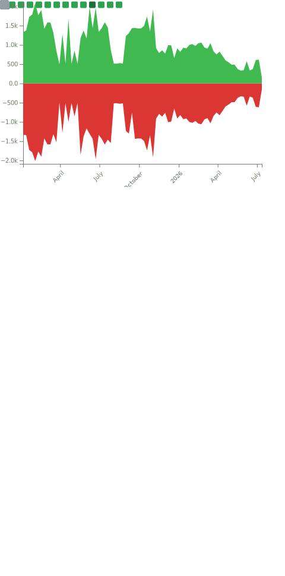
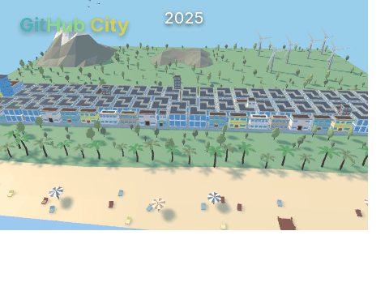

### Hi there 👋

  

Here are some ideas to get you started:

- 🔭 I’m currently working on ...
- 🌱 I’m currently learning ...
- 👯 I’m looking to collaborate on ...
- 🤔 I’m looking for help with ...
- 💬 Ask me about ...
- 📫 How to reach me: ...
- 😄 Pronouns: ...
- ⚡ Fun fact: ...

  
<h2>🐍 Watch my contribution graph get eaten by the snake</h2>

  

    
  

  
<h2>Activity</h2>

  <h3>🔖 Recent Blog Post</h3>

  <!-- BLOG-POST-LIST:START -->
 - 📔 Jun 2, 2026 [Character Building: Mengembangkan Diri](https://kingulee.com/posts/2026-06-character-building-part-3-self-development/)
 - 📔 Jun 1, 2026 [Character Building: Menerima Diri](https://kingulee.com/posts/2026-06-character-building-part-2-accepting-yourself/)
 - 📗 May 31, 2026 [Character Building: Mengenal Diri Sendiri](https://kingulee.com/posts/2026-06-character-building-part-1-knowing-yourself/)
 - 📘 Dec 24, 2025 [Implementasi Sistem Ujian Online SMKN 34 Jakarta](https://kingulee.com/portofolio/implementation-of-smkn-34-jakarta-online-examination-system/)
 - 📙 Apr 28, 2025 [Lampiran](https://kingulee.com/resume/)<!-- BLOG-POST-LIST:END -->

  <h3>📐 School Programs</h3>

  <!-- School-Programs:START -->
 - 📔 Feb 12, 2025 [Starlink WiFi: Revolusi Internet Satelit Global](https://schoolprograms.my.id/network/starlinkwifi-revolusi-internet-satelit-global/)
 - 📔 May 13, 2024 [Cara Push Project ke Github Mengunakaan GIT](https://schoolprograms.my.id/software/cara-push-ke-github-menggunakan-git/)
 - 📗 Apr 14, 2024 [Cara Lengkap Membuat Paragraf di HTML](https://schoolprograms.my.id/html/cara-membuat-paragraf-di-html/)
 - 📘 Feb 21, 2024 [Konvensi Pesan Commit Git](https://schoolprograms.my.id/github/konversi-pesan-commit-git/)
 - 📙 Feb 10, 2024 [Pengelolaan Data dengan Python Menggunakan Perulangan &lpar;Loop&rpar;](https://schoolprograms.my.id/python/sorting-data-list/)<!-- School-Programs:END -->

  
<h3>📊 Metrics</h3>

  
 <!-- Matrics -->
  
  
  
  
  
  
  
  

