### Hi there 👋

**azrielbsi/azrielbsi** is a ✨ _special_ ✨ repository because its `README.md` (this file) appears on your GitHub profile.

Here are some ideas to get you started:

- 🔭 I’m currently working on ...
- 🌱 I’m currently learning ...
- 👯 I’m looking to collaborate on ...
- 🤔 I’m looking for help with ...
- 💬 Ask me about ...
- 📫 How to reach me: ...
- 😄 Pronouns: ...
- ⚡ Fun fact: ...

  
<h2>🐍 Watch my contribution graph get eaten by the snake</h2>

  

    
  

  
<h2>Activity</h2>

  <h3>🔖 Recent Blog Post</h3>

  <!-- BLOG-POST-LIST:START -->
 - 📔 Jan 2, 2024 [Create a Daily Weather Report](https://julius-ulee.github.io/posts/weather/)
 - 📔 Nov 19, 2023 [School Programs Status: The monitoring real-time data from our GitHub repository.](https://julius-ulee.github.io/posts/status/)
 - 📗 Nov 9, 2023 [School Program: Achieving Learning Success: Commitment, Perseverance, and Consistency](https://julius-ulee.github.io/posts/school-program/)
 - 📘 Nov 5, 2023 [🦖Holobyte Hunter: Life of Pegasaurus](https://julius-ulee.github.io/posts/holobyte/)
 - 📙 Sep 3, 2023 [Daily Check-In Genshin Impact, Honkai Impact, Honkai: Star Rail](https://julius-ulee.github.io/posts/daily-check-in/)<!-- BLOG-POST-LIST:END -->

  <h3>📐 School Programs</h3>

  <!-- School-Programs:START -->
 - 📔 Feb 21, 2024 [Konvensi Pesan Commit Git](https://schoolprograms.my.id/github/konversi-pesan-commit-git/)
 - 📔 Feb 10, 2024 [Pengelolaan Data dengan Python Menggunakan Perulangan &lpar;Loop&rpar;](https://schoolprograms.my.id/python/sorting-data-list/)
 - 📗 Feb 8, 2024 [Pengenalan Penggunaan List Argument dalam Fungsi Pembuatan HTML](https://schoolprograms.my.id/python/argument-list/)
 - 📘 Feb 7, 2024 [Pemahaman dan Penggunaan Type Data Dictionary &lpar;Tuple&rpar; dalam Python](https://schoolprograms.my.id/python/dictionary-python/)
 - 📙 Feb 6, 2024 [Komparasi dan Logika pada Python](https://schoolprograms.my.id/python/komparasi-dan-logika-python/)<!-- School-Programs:END -->

  
<h3>📊 Metrics</h3>

  

    
    
    
    
    
  

